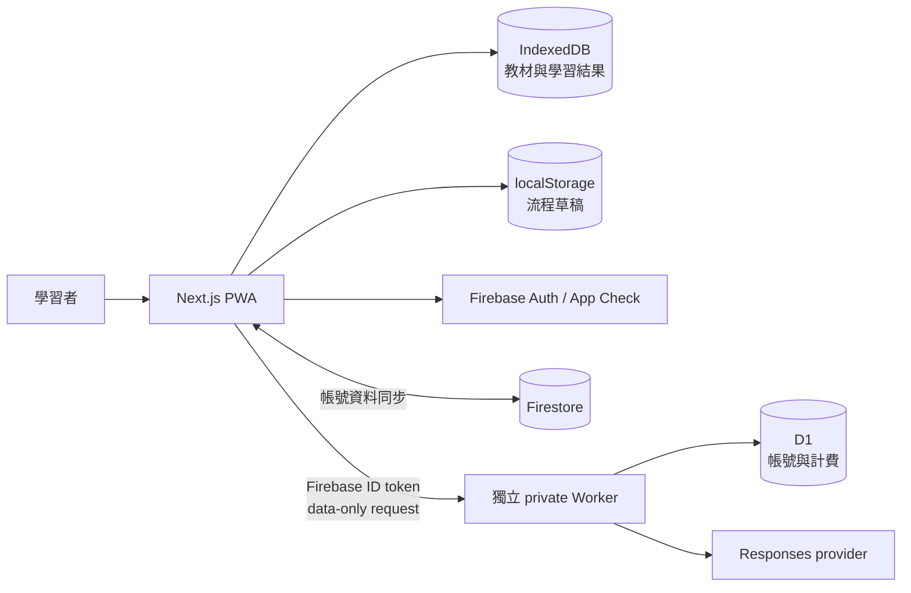

# Lexiro

Lexiro 是個人英文單字學習 PWA。把文字、照片或手動輸入整理成單字與詞義後，可以練習中文詞義選擇、拼字與學測題型，依 FSRS 排程複習並追蹤進度。教材與練習結果先保存在本機；登入後可同步到其他裝置。

## 問題與目標

同一個單字可能出現在不同教材，也可能有多個詞義。如果每個單字集各保存一份，修改例句、排程複習和查看成績就會互相分離。Lexiro 以詞義作為共享單位：單字集保存收錄關係，題目、FSRS 和統計都指向相同的 `SenseId`。

## 核心功能

- 教材：巢狀資料夾、單字集、詞義與例句編輯、搜尋、移動、匯入與分享。
- 擷取：手動輸入，或用 AI 整理文字／照片，再校對、生成並加入教材。
- 練習：本機四選一詞義題、拼字、詞彙、文法、克漏字、文意選填、篇章結構與閱讀。
- 複習：FSRS 到期排程、錯誤重練、標記項目與中斷接續。
- 進度：每日目標、連續學習、掌握程度、活動與題型表現。
- 資料：IndexedDB 保存、帳號隔離、選用 Firestore 同步、完整 ZIP 備份。
- AI：帳號模型偏好、Lite／Thinking／Pro 檔位、串流結果、部分成果接續與管理用量。
- PWA：可安裝、離線教材與練習、亮暗色，以及保存後才接管新版的更新流程。

## 系統架構



教材、題目和學習紀錄由 browser domain 處理；Firestore 是帳號資料的遠端副本。獨立的 `lexiro-worker` 管理 AI prompt、供應商憑證、點數與管理員，沒有教材資料庫的寫入職責。公開前端的 `packages/ai-contract` 只包含請求型別、解析器與程式採用的價格契約。

一次練習的答案會先保存學習資料，再推進畫面。一次 AI 生成則由 Worker 驗證身分、預留額度、呼叫供應商及結算；前端校對有效結果，按「加入」才寫入 Library。完整時序見[架構](docs/architecture.md)、[資料與同步](docs/data-and-sync.md)及[AI API](docs/ai-api.md)。

## 技術棧

| 層級 | 技術 | 用途 |
| --- | --- | --- |
| Web | Next.js 16.3.5、React 19.2、TypeScript 7 | App Router 與 PWA 介面 |
| UI | Tailwind CSS 4、Radix UI、Motion、HarmonyOS Sans TC | 元件、字型、亮暗色與動態 |
| State / forms | Zustand、TanStack Query、React Hook Form、Zod | Domain state、查詢與輸入 |
| 保存／排程 | idb-keyval、ts-fsrs 5.4 | IndexedDB 與複習排程 |
| 帳號／同步 | Firebase Auth、Firestore、App Check | Google 登入、帳號資料與 attestation |
| AI backend | Cloudflare Workers、D1、Responses API | 驗證、生成、計費與管理 |
| 離線／備份 | Serwist 9、fflate | App 資產快取與 ZIP 備份 |
| 驗證 | Vitest 4、Testing Library、Oxlint | 單元／元件檢查及 client boundary |

固定依賴在 `package-lock.json`，AI backend 有自己的 lockfile 和部署流程。

## 快速開始

使用 Node.js 24，與 GitHub Actions 一致。在 PowerShell 7 執行：

```powershell
npm ci
npm run dev
```

開啟 `http://localhost:3000/app`。根路徑 `/` 是公開介紹頁，學習工作區位於 `/app`。純本機模式不設定 Firebase；要開啟登入同步才複製 `.env.example` 到 `.env.local` 並填真實值。AI 另外需要運作中的 Worker 和已登入帳號。離線功能用 production build 與 Service Worker 驗證，`next dev` 不註冊它。

```powershell
npm run typecheck
npm run lint
npm run test
npm run build
```

`build` 的 postbuild 會檢查 client bundle 是否含 private prompt 指紋。本機檢查不呼叫付費模型，詳細流程見[本機開發](docs/local-development.md)與[測試](docs/testing.md)。

## 文件

- [文件索引](docs/README.md)
- [產品與操作](docs/product.md)
- [路由、帳號與權限](docs/routes-and-permissions.md)
- [系統架構](docs/architecture.md)
- [資料模型、保存與同步](docs/data-and-sync.md)
- [練習與 FSRS](docs/practice.md)
- [AI 生成與 API](docs/ai-api.md)
- [設定參考](docs/configuration.md)
- [本機開發](docs/local-development.md)
- [部署](docs/deployment.md)
- [測試與驗證](docs/testing.md)
- [文件與流程地圖維護](docs/documentation-maintenance.md)
- [程式責任索引](structure.md)
- [離線程式流程地圖](tools/project-map/README.md)

執行 `node tools/project-map/build.mjs` 產生桌面的 `Lexiro-程式流程地圖.html`，內嵌公開原碼、資料形狀與流程；Worker 只提供核對後的 schema／排程／版本 metadata。成品可離線閱讀，更新程式後重新產生。

## 現行邊界

同步、AI 和登入都需要網路。瀏覽器儲存空間可能被清除，備份仍由使用者匯出保管。本機詞義題需要三個不同且不與目標詞義重疊的干擾答案；不足時略過該題。AI 結構驗證不能證明語意、辨識與教學品質，生成結果保留校對入口。

管理員只由 private Worker 的 `ADMIN_EMAILS` 與已驗證 email 判定；前端不能授予管理員或設定供應商金鑰。Firestore schema、備份、練習快照與 AI contract 各有自己的版號，更新時依[資料文件](docs/data-and-sync.md)處理。
