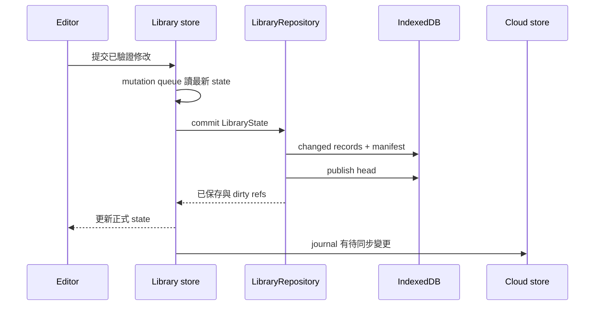

# 系統架構

| 位置 | 責任 |
| --- | --- |
| `app/` | 公開介紹、`/app` routes、layout、offline page、Service Worker |
| `components/` | 教材、練習、進度、設定與共用視覺元件 |
| `stores/` | Zustand Library／learning／cloud／AI preference state |
| `src/lib/` | Domain 操作、FSRS、保存、同步、備份、解析與 migration |
| `lib/` | 路由、managed API、更新與跨 store 操作協調 |
| `packages/ai-contract/` | 無秘密的 AI 型別、來源解析、價格算術 |

`src/` 是仍在使用的 browser domain。AI server 在獨立 private `lexiro-worker`；Next.js 工作區不持有 provider key、private prompt 或 D1 credential。

## 一次教材保存

Commit 的原子可見性來自 head pointer。記錄／manifest 寫到一半時，上一代仍可讀；保存成功才更新 UI。Learning、AI preferences 各有保存佇列；帳號切換與備份由 account-data queue 協調。

## AI 工作

Public task builder 拆批，`runner.ts` 依序呼叫 managed client。Worker 驗 token、Origin、模型與輸入，D1 預留額度後送 Responses request。串流保留文字並移除上下文回顯；終止前完成結算或保存 pending usage，再把結果送給 client。

前端解析與組裝題目，保留有效部分；生成頁和校對頁分開，按加入才寫 Library。Response cursor 與來源計費身份由 Worker 核對，另一帳號的 cursor 不能接入。

## 登入與同步

Cloud store 等待 Firebase session，先切到 UID namespace 載入本機資料，再 reconcile 遠端。Library 以 Firestore `writtenAt + documentId` 拉取增量，保留未推送的 dirty records，push 後只清本次 journal version。學習資料與模型偏好另走 account／preference 文件。

離線時仍保存本機，journal 保留未送變更。重新連線、其他分頁的 meta marker 或手動同步觸發下一次 reconcile；帳號改變時拒絕過期回覆。詳見[資料與同步](data-and-sync.md)。

## PWA 更新

Serwist 只在 production 啟用。App 公開資產與頁面可快取，登入請求和跨來源資料使用 NetworkOnly；新版接管時清舊私人／跨來源快取，保留 App 資產。

`app-update-monitor` 觀察等待新版，使用者在「我的」檢查／重新啟動。`lib/app-update.ts` 先保存、送 `SKIP_WAITING`，等待 controller 接管才重載；重新連線不自動刷新練習或編輯。忙碌、失敗和可重試狀態由獨立 store 管理。
