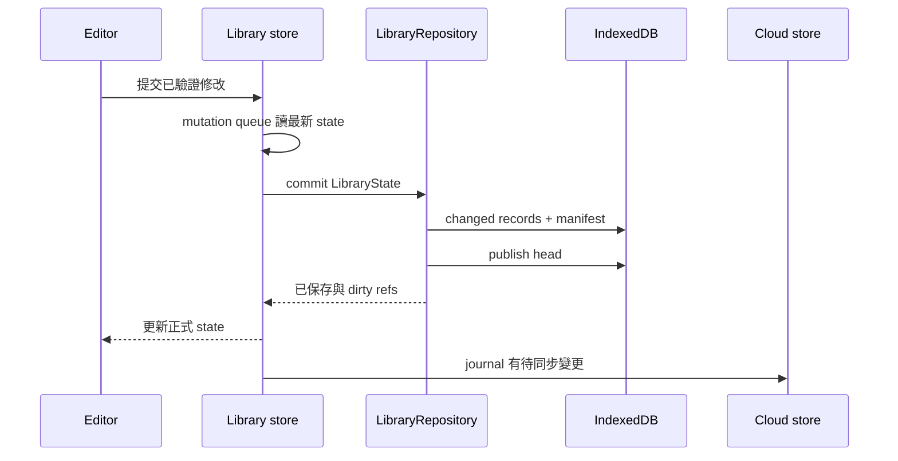

# 系統架構

| 位置 | 責任 |
| --- | --- |
| `app/` | 入口、路由表、layout、offline page、Service Worker |
| `components/` | 教材、練習、設定與共用視覺元件 |
| `stores/` | Zustand Library／cloud／UI／update state |
| `src/lib/` | Domain 操作、保存、同步、備份、解析與 migration |
| `lib/` | 路由、更新與跨 store 操作協調 |
| `packages/ai-contract/` | 無秘密的共用題型、字數與詞性格式 |

`src/` 是仍在使用的 browser domain。Agent Worker 在獨立 private `lexiro-worker`；前端工作區不持有 D1 credential 或 private prompt。

## 一次教材保存

```mermaid
sequenceDiagram
    participant UI as Editor
    participant Store as Library store
    participant Repo as LibraryRepository
    participant DB as IndexedDB
    participant Sync as Cloud store
    UI->>Store: 提交已驗證修改
    Store->>Store: mutation queue 讀最新 state
    Store->>Repo: commit LibraryState
    Repo->>DB: changed records + manifest
    Repo->>DB: publish head
    Repo-->>Store: 已保存與 dirty refs
    Store-->>UI: 更新正式 state
    Store->>Sync: journal 有待同步變更
```

Commit 的原子可見性來自 head pointer。記錄／manifest 寫到一半時，上一代仍可讀；保存成功才更新 UI。帳號切換與備份由 account-data queue 協調。

## Agent 寫入

Agent 透過 MCP 連線讀寫教材；公開前端只提供授權、連線管理與資料畫面。Worker 驗 Firebase ID token、Origin 與輸入，資料寫入自己的 D1。Agent 自行產生內容，Lexiro 不呼叫模型，也不管理點數或方案。

前端依 server `(seq, recordId)` 拉回增量並保留 dirty；Agent 修改與本機編輯最後合併為同一份 canonical 教材，通過結構與來源驗證的題目才保存。

## 登入與同步

Cloud store 等待 Firebase Auth，先切到 `d1-v1:<uid>` namespace，再 reconcile D1。Library 以 server `(seq,recordId)` 拉增量，保留未送 dirty records，push 後只清本次 journal version。偏好與練習草稿使用 blob revision。前端與 Agent 共用 Worker repository，Firebase 不再儲存教材。

離線保存本機並保留 journal。visible／online 每 30 秒查一筆狀態，有外部變更才拉增量；重新連線／手動同步亦可 reconcile，帳號改變拒絕舊回覆。舊 Firestore 與快取不遷移，見 [D1 雲端](d1-cloud.md)。

## PWA 更新

Serwist（`@serwist/vite`）只在 production 啟用。build 時 precache App shell 與每個畫面的 JS／CSS，沒開過的畫面離線也能開；離線開任何網址都回 precache 的 `index.html`，由 router 依網址畫出畫面。其他公開資產與頁面在 runtime 快取，登入請求和跨來源資料使用 NetworkOnly；新版接管時清舊私人／跨來源快取，保留 App 資產。

`app-update-monitor` 觀察等待新版，使用者在「我的」檢查／重新啟動。`lib/app-update.ts` 先保存、送 `SKIP_WAITING`，等待 controller 接管才重載；重新連線不自動刷新練習或編輯。忙碌、失敗和可重試狀態由獨立 store 管理。
## 網頁介面與本機學習紀錄

主要導覽為今天（`/app`）、我的單字（`/app/library`）、進度（`/app/progress`）、對戰（`/app/rooms`）。桌面為側欄，手機為浮動圖示 dock；舊 `/app/me`、`/app/me/*` 與 `/app/sync` 深連結打開設定 dialog／sheet。進行中的練習、結果及對戰隱藏導覽。

`app/styles/strata/tokens.css`、`components.css` 與 `app/styles/lexiro.css` 採用設計預覽的詞彙；`redesign.css` 對接保留的表單、工具頁與無框線狀態。主題以 `data-theme="pine"` 與 `data-scheme="light|dark"` 表達。書寫規則優先於預覽中的漸層、光暈與選取框線。

`src/lib/learning-record.ts` 是平台無關的純運算，`stores/learning-store.ts` 負責依帳號 namespace 保存 localStorage；不修改 Worker API，也不把本機學習紀錄加入雲端 blob。作答、目標、熟悉度、熱圖與統計的規則見 [練習](practice.md)。單字集 `hue`、`icon` 是可選欄位，既有資料使用 mint／books；教材儲存、備份、分享與既有 record 同步序列化均保留它們。

開發用 `?demo=1` 啟用獨立的 `lexiro-product-demo` namespace，session 內持續啟用；`?demo=0` 關閉。`lib/dev/demo.ts` 僅由 `import.meta.env.DEV` 分支動態載入，提供本機教材、假帳號、學習歷史與 Agent／admin／room 回覆；production bundle 不包含該模組。`?reset=1` 重建假資料，`?empty=1` 顯示空資料，`?emptySet=1` 顯示空集合。開發對戰可用 `?state=game|finished`，練習可用 `?run=1&tasks=meaning&answer=right|wrong` 或 `&result=1` 直接取證。

取證：先執行 `npm run dev -- --host 127.0.0.1 --port 5173` 與 `node design/preview/serve.mjs`，再執行 `node design/shots-app.mjs`。截圖、路由清單與 overflow audit 在 `design/shots/app/`；實際保存與讀回的瀏覽器驗證為 `node design/verify-app.mjs`。
